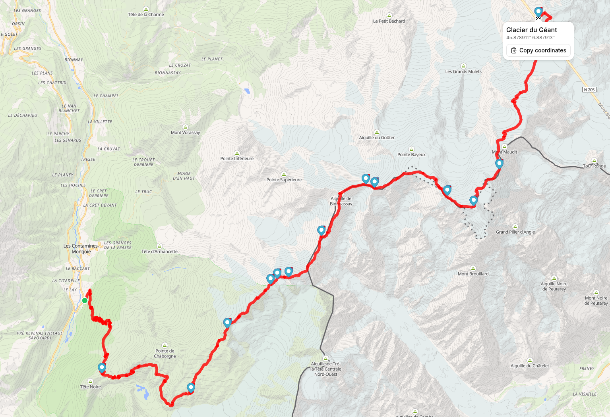

# trailscan

**trailscan** is a tool for analyzing GPX tracks using data from OpenStreetMap.

```bash
trailscan help
NAME:
   trailscan - a tool for analyzing GPX tracks using data from OpenStreetMap

USAGE:
   trailscan <track.gpx> [OPTIONS]

DESCRIPTION:
   trailscan is a tool for analyzing GPX tracks using data from OpenStreetMap.
   It matches recorded GPS positions against geographic features to determine where a track passes and what locations were visited.
   The resulting track can be annotated with information such as mountain summits, landmarks, points of interest,
   and other geographic features encountered along the route.

COMMANDS:
   querytemplates  Print all predefined querytemplates
   annotate        Annotates a GPX file with waypoints using a JSON input, outputs a GPX file annotated with the provided waypoints
   help, h         Shows a list of commands or help for one command

GLOBAL OPTIONS:
   --endpoint string, -e string            endpoint to use to send the overpass query (default: "https://overpass-api.de/api/interpreter")
   --query-template string, -q string      use a predefined query, supported queries are [cycling hiking peaks village], or a path to a valid query template file (default: "peaks")
   --output string, -o string              output format to use, supported output formats are [text json] (default: "text")
   --max-distance float, --md float        configure the maximum distance (in meters) between tracked and actual (default: 50)
   --max-elevation-diff float, --me float  configure the maximum elevation difference (in meters) between tracked and actual (default: 30)
   --no-simplify-gpx                       disables simplifying GPX tracks (disables speedup)
   --sort string, -s string                sort the output (only in case of text output) (default: "num")
   --sort-inverted, --si                   invert the sorting, default: ascending
   --help, -h                              show help
```

## Example usage

### Cycling


Example track: [Großglockner-Weissensee (Ktn) August 2018 (from outdooractive.com)](https://www.outdooractive.com/r/123337427)

```bash
trailscan testdata/grossglockner-weissensee.gpx -q cycling --md 100 -me 50 --no-simplify-gpx
NUM  NAME                     TYPE       LAT       LON       ELEVATION  TRACKED ELEVATION  DISTANCE
  1  Fuscher Törl             saddle     47.11735  12.82749  2402m      2402m              8.5m
  2  Blick zum Fuscher Törl   viewpoint  47.11603  12.82362  0m         2428m              60.1m
  3  Tauernfenster            viewpoint  47.10834  12.83445  0m         2288m              36.4m
  4  Hochtor                  viewpoint  47.08088  12.84265  2504m      2504m              13.1m
  5  Kirche und Großglockner  viewpoint  47.03901  12.84399  0m         1294m              35.4m
  6  Jungfernsprung           viewpoint  47.01110  12.86847  0m         1095m              33.2m
  7  Winklern                 village    46.87045  12.87768  0m         935m               78.2m
  8  Göriach                  village    46.83417  12.83298  0m         796m               94.2m
  9  Unterpirkach             village    46.75747  12.92669  0m         640m               81.8m
 10  Flaschberg               village    46.75055  12.93614  0m         629m               66.0m
 11  Ötting                   village    46.74304  12.96001  0m         627m               76.1m
 12  Oberdrauburg             village    46.74837  12.97013  0m         623m               65.8m
 13  Feistritz                village    46.73367  13.11770  0m         616m               32.8m
 14  Techendorf               village    46.71795  13.29024  0m         941m               17.2m
```

### Hiking


Example track: [Traversée Royale: The Royal Mont Blanc Traverse (from outdooractive.com)](https://www.outdooractive.com/r/123337427)

```bash
trailscan testdata/traversee-royale.gpx -q hiking --md 50 --me 30
NUM  NAME                                         TYPE            LAT       LON      ELEVATION  TRACKED ELEVATION  DISTANCE
  1  Abri sur le chemin du refuge de Tré la tête  picnic_shelter  45.80132  6.73643  0m         1729m              46.3m
  2  Refuge de Tré la Tête                        alpine_hut      45.79175  6.73478  0m         1965m              10.3m
  3  Refuge des Conscrits                         alpine_hut      45.78687  6.76615  2614m      2601m              27.4m
  4  Dômes de Miage                               peak            45.81527  6.80028  3673m      3658m              4.6m
  5  Col de Miage                                 saddle          45.82512  6.81142  3358m      3338m              27.7m
  6  Refuge Durier                                alpine_hut      45.82538  6.81177  3358m      3341m              8.8m
  7  Aiguille de Bionnassay                       peak            45.83605  6.81867  4052m      4035m              29.4m
  8  Col de Bionnassay                            saddle          45.83805  6.82734  3888m      3877m              19.9m
  9  Piton des Italiens                           peak            45.83721  6.83043  4002m      3992m              6.4m
 10  Col du Dôme                                  saddle          45.84112  6.84704  4250m      4238m              39.2m
 11  Refuge Vallot                                wilderness_hut  45.83908  6.85213  4322m      4344m              32.4m
 12  Petite Bosse                                 peak            45.83523  6.85591  4547m      4542m              18.0m
 13  Rocher de la Tournette                       peak            45.83288  6.85991  4677m      4703m              33.8m
 14  Mont Blanc / Monte Bianco                    peak            45.83271  6.86517  4807m      4806m              9.7m
 15  Col de la Brenva / Colle della Brenva        saddle          45.84172  6.87418  4309m      4299m              3.4m
 16  Glacier du Géant                             viewpoint       45.87891  6.88791  0m         3769m              6.0m
 17  Terrasse 3842                                viewpoint       45.87864  6.88743  0m         3769m              42.4m
```

### Annotating GPX tracks with waypoints

The JSON output from the option `-o json` can be used as input to the subcommand `annotate` to annotate a GPX track with waypoints.
It supports reading from file or standard input.
JSON input file may also be manually created or modified.

Example usage:
```bash
trailscan testdata/traversee-royale.gpx -q hiking -md=50 --me 30 -o json | trailscan annotate testdata/traversee-royale.gpx > testdata/traversee-royale.waypoints.json

# same as storing JSON output as intermediate file
trailscan testdata/traversee-royale.gpx -q hiking -md=50 --me 30 -o json > tmp.json
trailscan annotate testdata/traversee-royale.gpx -i tmp.json > testdata/traversee-royale.waypoints.json
```

Produces the following GPX output


## Get trailscan

### From source

With a working golang toolchain execute the following:

```bash
git clone https://github.com/davidkroell/trailscan # clone
cd trailscan
just build # build

# use
./bin/trailscan -h
```
