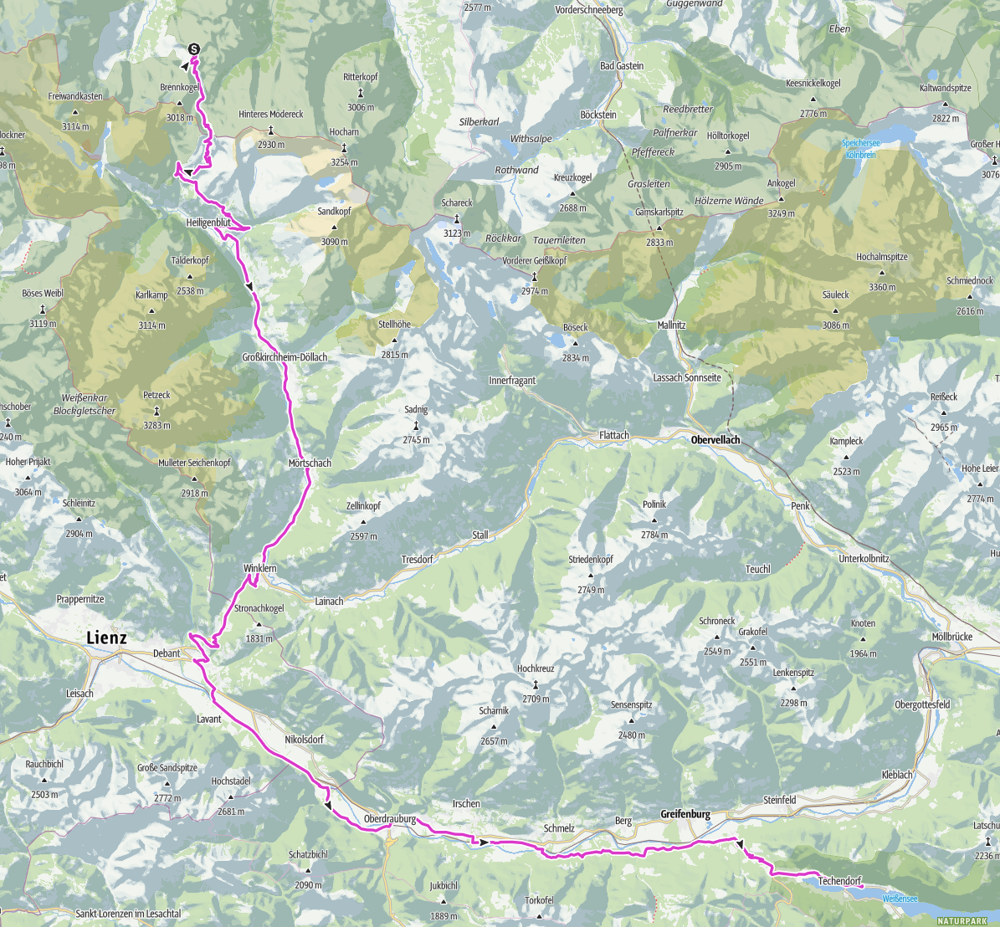
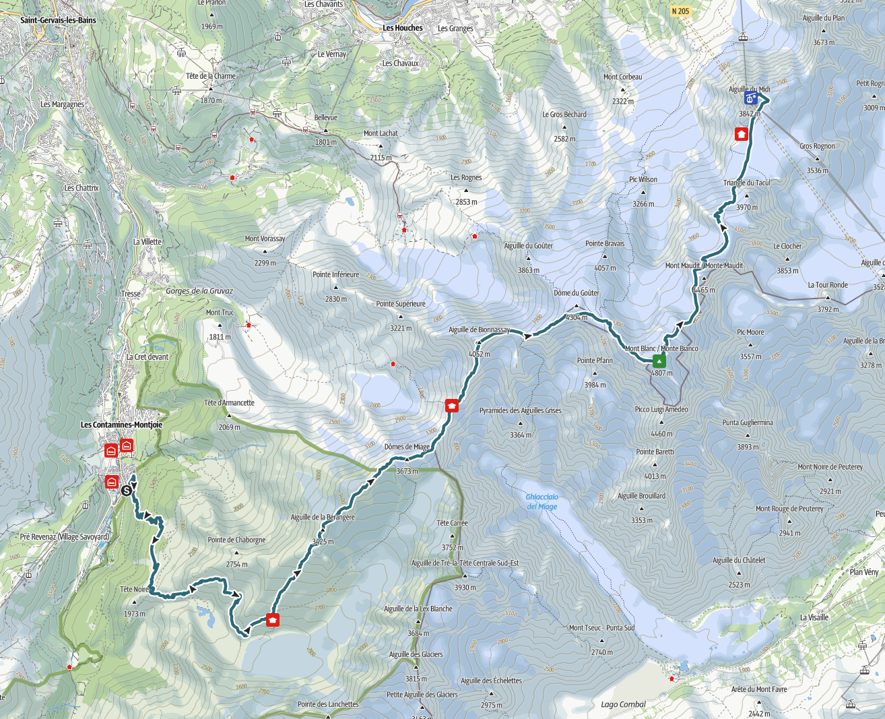

# trailscan

**trailscan** is a tool for analyzing GPX tracks using data from OpenStreetMap.

```bash
trailscan -h                                                                         
NAME:
   trailscan - a tool for analyzing GPX tracks using data from OpenStreetMap.

USAGE:
   trailscan <track.gpx> [OPTIONS]

DESCRIPTION:
   trailscan is a tool for analyzing GPX tracks using data from OpenStreetMap.
   It matches recorded GPS positions against geographic features to determine where a track passes and what locations were visited.
   The resulting track can be annotated with information such as mountain summits, landmarks, points of interest,
   and other geographic features encountered along the route.

GLOBAL OPTIONS:
   --overpass-endpoint string, -e string   endpoint to use to send the overpass query (default: "https://overpass-api.de/api/interpreter")
   --overpass-query-type string            uses a predefined query, supported queries are [peaks, villages, hiking, cycling] (default: "peaks")
   --output string, -o string              output format to use, supported output formats are [text, json] (default: "text")
   --max-distance float, --md float        configure the maximum distance (in meters) between tracked and actual (default: 50)
   --max-elevation-diff float, --me float  configure the maximum elevation difference (in meters) between tracked and actual (default: 30)
   --help, -h                              show help
```

## Example usage

### Cycling



Example track: [Großglockner-Weissensee (Ktn) August 2018 (from outdooractive.com)](https://www.outdooractive.com/r/123337427)

```bash
trailscan testdata/grossglockner-weissensee.gpx --overpass-query-type=cycling --max-distance=100
NUM  NAME                     TYPE       LAT       LON       REAL ELEVATION  TRACKED ELEVATION  DISTANCE
  1  Fuscher Törl             saddle     47.11735  12.82749  2402m           2402m              8.5m
  2  Blick zum Fuscher Törl   viewpoint  47.11603  12.82362  0m              2428m              60.1m
  3  Tauernfenster            viewpoint  47.10834  12.83445  0m              2288m              36.4m
  4  Hochtor                  viewpoint  47.08088  12.84265  2504m           2504m              13.1m
  5  Kirche und Großglockner  viewpoint  47.03901  12.84399  0m              1294m              35.4m
  6  Jungfernsprung           viewpoint  47.01110  12.86847  0m              1095m              33.2m
  7  Winklern                 village    46.87045  12.87768  0m              935m               78.2m
  8  Göriach                  village    46.83417  12.83298  0m              796m               94.2m
  9  Unterpirkach             village    46.75747  12.92669  0m              640m               81.8m
 10  Flaschberg               village    46.75055  12.93614  0m              629m               66.0m
 11  Ötting                   village    46.74304  12.96001  0m              627m               76.1m
 12  Oberdrauburg             village    46.74837  12.97013  0m              623m               65.8m
 13  Feistritz                village    46.73367  13.11770  0m              616m               32.8m
 14  Techendorf               village    46.71795  13.29024  0m              941m               17.2m
```

### Hiking



Example track: [Traversée Royale: The Royal Mont Blanc Traverse (from outdooractive.com)](https://www.outdooractive.com/r/123337427)

```bash
trailscan testdata/traversee-royale.gpx --overpass-query-type=hiking --max-distance=50
NUM  NAME                                   TYPE        LAT       LON      REAL ELEVATION  TRACKED ELEVATION  DISTANCE
  1  Refuge de Tré la Tête                  alpine_hut  45.79175  6.73478  0m              1965m              10.3m
  2  Aiguille de la Bérangère               peak        45.80277  6.77879  3425m           3412m              6.3m
  3  Col de la Bérangère                    saddle      45.80534  6.78223  3348m           3337m              34.5m
  4  Dômes de Miage - Pointe Sud-Ouest      peak        45.81043  6.78979  3670m           3651m              21.7m
  5  Dômes de Miage (2nd dôme)              peak        45.81353  6.79393  3633m           3613m              8.9m
  6  Col des Dômes                          saddle      45.81489  6.79628  3564m           3541m              16.6m
  7  Dômes de Miage                         peak        45.81527  6.80028  3673m           3658m              4.6m
  8  Col de Miage                           saddle      45.82512  6.81142  3358m           3335m              14.4m
  9  Aiguille de Bionnassay                 peak        45.83605  6.81867  4052m           4035m              29.4m
 10  Col de Bionnassay                      saddle      45.83805  6.82734  3888m           3877m              19.9m
 11  Piton des Italiens                     peak        45.83721  6.83043  4002m           3992m              6.4m
 12  Col du Dôme                            saddle      45.84112  6.84704  4250m           4237m              33.3m
 13  Grande Bosse                           peak        45.83606  6.85460  4513m           4511m              22.7m
 14  Petite Bosse                           peak        45.83523  6.85591  4547m           4542m              18.0m
 15  Rocher de la Tournette                 peak        45.83288  6.85991  4677m           4703m              33.8m
 16  Mont Blanc / Monte Bianco              peak        45.83271  6.86517  4807m           4806m              9.7m
 17  Col de la Brenva / Colle della Brenva  saddle      45.84172  6.87418  4309m           4299m              3.4m
 18  Col de la Brenva / Colle della Brenva  saddle      45.84172  6.87418  4309m           4299m              3.4m
 19  Glacier du Géant                       viewpoint   45.87891  6.88791  0m              3769m              6.0m
 20  Terrasse 3842                          viewpoint   45.87864  6.88743  0m              3769m              42.4m
```

## Get trailscan

### From source

With a working golang toolchain execute the following:

```bash
git clone https://github.com/davidkroell/trailscan # clone
cd trailscan
just build # build

# use
./bin/trailscan -h
```
